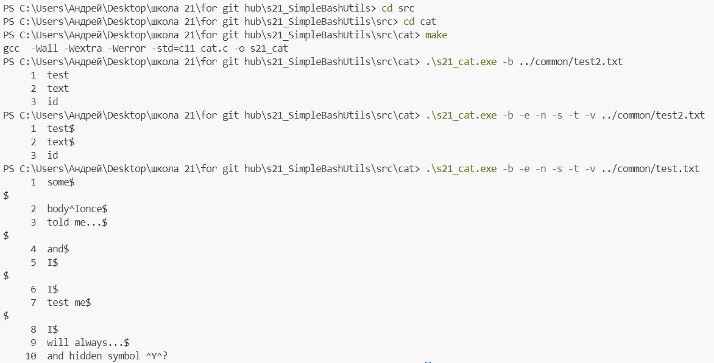
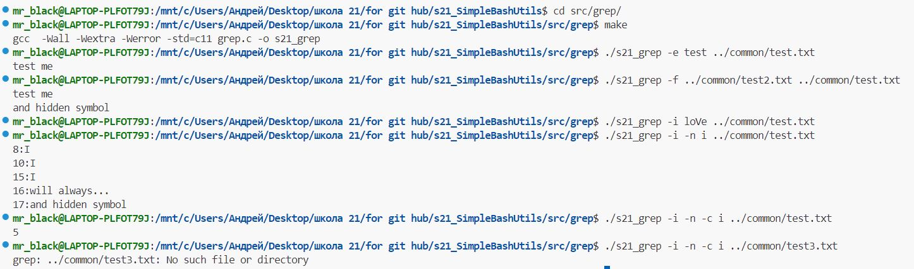

# Simple Bash Utils

Разработка утилит Bash по работе с текстом: cat, grep.

## Contents

1. [Introduction](#introduction)
2. [CAT](#cat)
3. [GREP](#grep)
4. [Conclusion](#conclusion)
5. [Examples](#examples) \
    5.1. [Run Cat](#run-cat) \
    5.2. [Run Grep](#run-grep)

## Introduction

В этом проекте разработаны базовые утилиты Bash по работе с текстами на языке программирования Си. Эти утилиты (cat и grep) достаточно часто используются при работе в терминале Linux. 

## CAT

### cat Использование

Cat - одна из наиболее часто используемых команд в Unix-подобных операционных системах. Команда имеет три взаимосвязанные функции в отношении текстовых файлов: отображение, объединение их копий и создание новых.

Порядок выполнения команды:

`cat [OPTION] [FILE]...`

### cat Опции

| № | Опции | Описание |
| ------ | ------ | ------ |
| 1 | -b | нумерует только непустые строки |
| 2 | -e (предполагает и -v) | также отображает символы конца строки как $  |
| 3 | -n | нумерует все выходные строки |
| 4 | -s | сжимает несколько смежных пустых строк |
| 5 | -t (предполагает и -v) | также отображает табы как ^I |
| 6 | -v | отображает невидимые символы

## GREP
### grep Использование

Grep — утилита командной строки, которая находит на вводе строки, отвечающие заданному регулярному выражению.

Порядок выполнения команды:

`grep [options] template [file_name]`

### grep Опции

| № | Опции | Описание |
| ------ | ------ | ------ |
| 1 | -e | Шаблон |
| 2 | -i | Игнорирует различия регистра.  |
| 3 | -v | Инвертирует смысл поиска соответствий. |
| 4 | -c | Выводит только количество совпадающих строк. |
| 5 | -l | Выводит только совпадающие файлы.  |
| 6 | -n | Предваряет каждую строку вывода номером строки из файла ввода. |
| 7 | -h | Выводит совпадающие строки, не предваряя их именами файлов. |
| 8 | -s | Подавляет сообщения об ошибках о несуществующих или нечитаемых файлах. |
| 9 | -f file | Получает регулярные выражения из файла. |
| 10 | -o | Печатает только совпадающие (непустые) части совпавшей строки. |

## Conclusion

- Программы разработаны на языке Си стандарта C11 с использованием компилятора gcc 
- Программы представляют собой исполняемый файл с аргументами командной строки
- Сборка программ настроена с помощью Makefile с соответствующими целями: s21_cat, s21_grep  
- Выполнено покрытие интеграционными тестами для всех вариантов флагов и входных значений, на базе сравнения с поведением реальных утилит Bash

## Examples
- Пример выполнения кода с использованием "Cat" с флагами

(код запускался непосредственно в windows)

- Пример выполнения кода с использованием "Grep" с различными флагами и их комбинациями

(код запускался с помощью WSL)

## Run Cat
- для запуска программы Cat напишите:

`cd src/cat` \
`make` \
`./s21_cat [флаги] [имя файла]`

## Run Grep
- для запуска программы Grep напишите:

`cd src/grep` \
`make` \
`./s21_grep [флаги] [шаблон] [имя файла]`